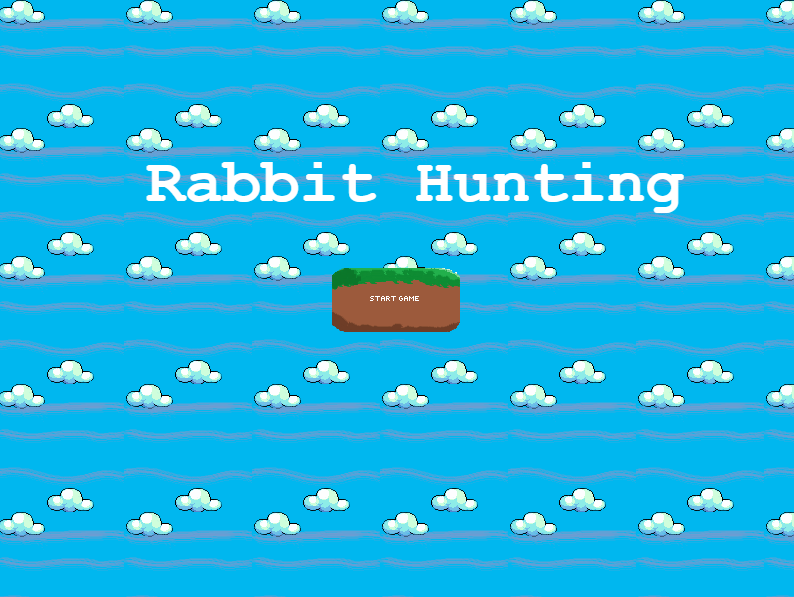
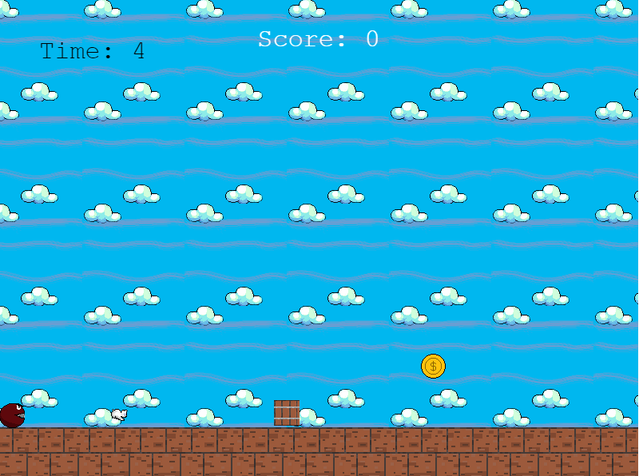
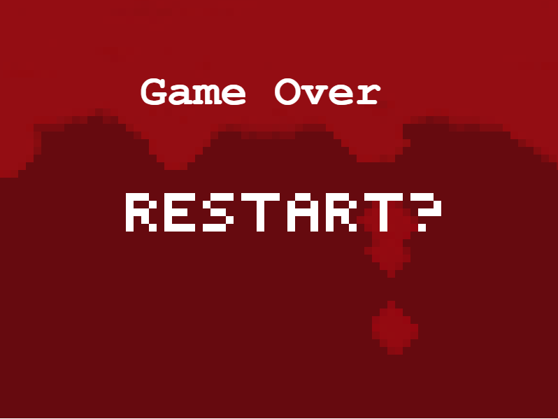
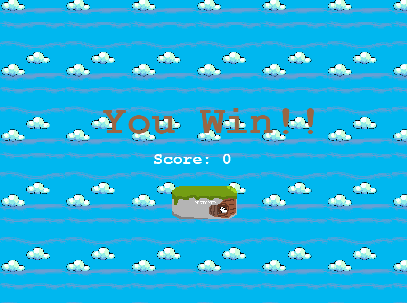

# rabbithunting-GamePhysics
# MMU Game Physics Project 1 (PhaserJS)

Group Members: Raymond Sianjaya (1181202359) - game

 Introduction: This game is a sidescroller dodging game that is taking inspiration from popular game such as subway surfer, temple run, or the dinosaur game in google offline. The objective of the game is just getting a score as high as you can and survive for the timer to finish while running from the enemy (hunter).

 Documentations of Your Game: The game have some sets of objective by avoiding obstacles and collecting coins. Coin will be the score you get when collecting them. The longer the game goes the faster the speed of the game. There is also a timer that you need to survive for to win. 

 User Manual / Instructions: To run the game all you have to do is open the index.html if its not possible use a live server plugin from vs code and right click and select "Open with live server". When it opens all you have to do is press the start button on the game. Use 'Up arrow' and 'down arrow' key to jump and fasten the descend.

 Screenshots: 

 Link to Video Demo. 
https://youtu.be/ENSmzo0Lgak

 Acknowledgment: thank you to my brother to help me debug the winscene now its able to pass the score data correctly

 References: Temple Run, subway surfer, jetpack joyride, or the dinosaur google game and some of this website for their tools or sounds that i use for the assets.
- https://mixkit.co/free-sound-effects/video-game/
- https://www.pixilart.com/gallery
